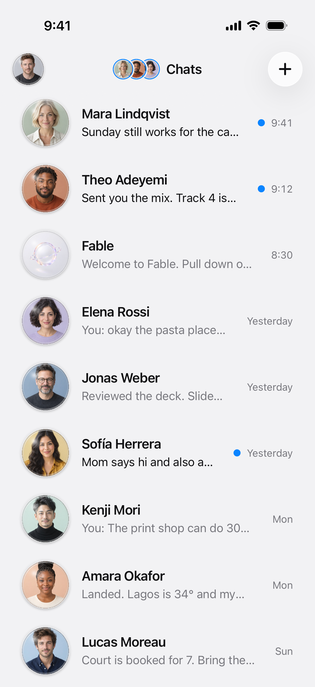
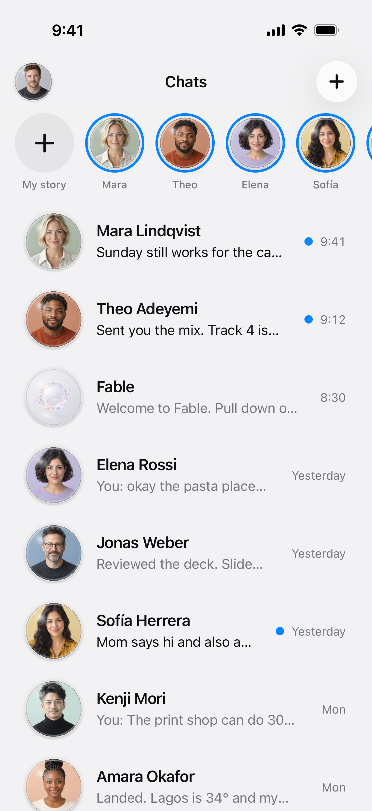
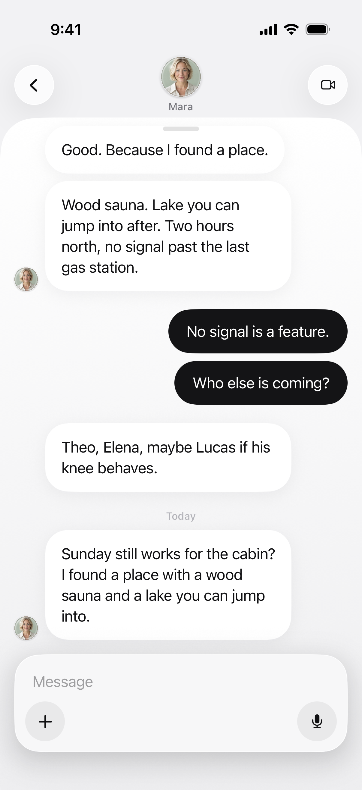
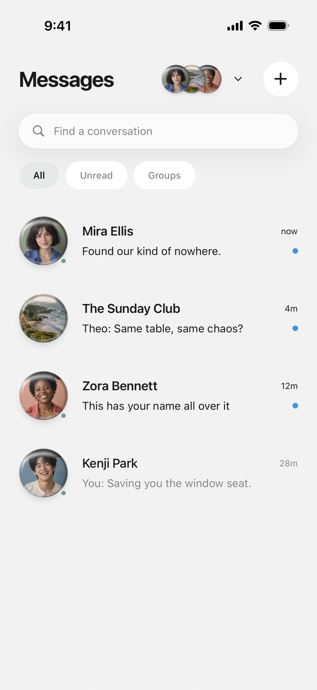
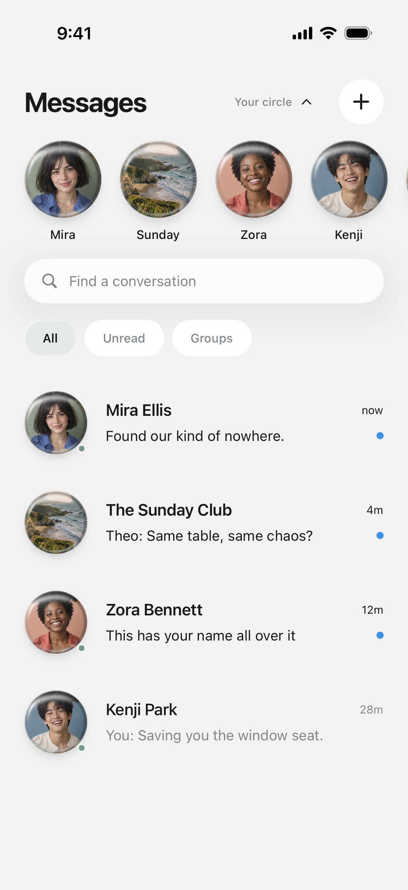
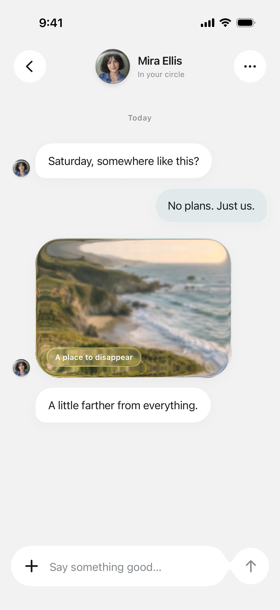

<p align="center">
  <a href="https://appllama.io">
    <picture>
      <source media="(prefers-color-scheme: dark)" srcset="./docs/images/appllama-logo-dark.png">
      <source media="(prefers-color-scheme: light)" srcset="./docs/images/appllama-logo-light.png">
      
    </picture>
  </a>
</p>

<h1 align="center">React Native Expo Liquid Glass Chat UI</h1>
<p align="center">Two chat cookbooks. Glass portraits, reversible gestures, and conversations that move with the keyboard.</p>
<p align="center">
  
  
  
  
  <a href="./LICENSE"></a>
</p>
<p align="center">
  <a href="#the-2-cookbooks">Explore cookbooks</a> ·
  <a href="#copy-paste-prompts">Copy a prompt</a> ·
  <a href="#run-the-expo-gallery">Run locally</a> ·
  <a href="#artwork">Artwork</a> ·
  <a href="#verification">Verification</a>
</p>

## The 2 cookbooks

### Cookbook 1 (Fable)

<table><tr>
<td></td>
<td></td>
<td></td>
</tr></table>

A compact portrait cluster unfolds into a horizontally scrolling story rail. Conversations sit in a quiet rounded panel, with dark outgoing bubbles and a floating native glass composer. Open a story, share its photo, or type a message and receive a local sample reply.

### Cookbook 2 (Astra)

<table><tr>
<td></td>
<td></td>
<td></td>
</tr></table>

A reversible ribbon fans out from the header. The selected portrait travels into the conversation while the page fades around it. Native glass bubbles, a keyboard-following composer, photo zoom, and heart reactions complete the flow.

<p align="center"><sub>Previews are direct iPhone simulator captures of this implementation.</sub></p>

| Cookbook | Route | Source | Artwork | Integration prompt |
| --- | --- | --- | --- | --- |
| Cookbook 1 (Fable) | `/fable` | [Fable](./src/cookbooks/fable) | [Portraits and stories](./assets/cookbooks/fable) | [Copy prompt](#prompt-fable) |
| Cookbook 2 (Astra) | `/astra` | [Astra](./src/cookbooks/astra) | [Portraits and coast](./assets/cookbooks/astra) | [Copy prompt](#prompt-astra) |

## One Expo project. Two independent implementations.

The gallery keeps each cookbook's screens, components, theme, motion, and sample data together. Route files are thin adapters. Neither cookbook imports the other, and their local message stores use separate MMKV namespaces.

Both cookbooks include light and dark appearance, sample message persistence, a contact picker, image sharing, and a way back to the gallery. Fable adds timed stories and simulated replies. Astra adds search, unread/group filters, mute state, reactions, and native photo transitions.

These are UI cookbooks with local sample content. Messages do not leave the device. Voice recording and video calling are not provided; their controls explain that they are unavailable in this preview.

## Run the Expo gallery

Requirements: macOS, Node.js 22.13 or newer, Xcode 26 or newer, CocoaPods, and an iOS 26 simulator. This gallery targets iPhone portrait layouts. Native dependencies include Skia, MMKV, and Keyboard Controller, so use a native build.

```bash
cd liquid-glass-chat-ui
npm ci
npm run ios:release
```

Choose your simulator when prompted. A Release build bundles JavaScript and runs without Metro. For development:

```bash
npm run ios
```

The first native build takes longer while CocoaPods installs dependencies. `ios/` is generated from `app.json` and is intentionally ignored. There are no required environment variables, credentials, remote image URLs, or services.

Open a cookbook directly on a booted simulator:

```bash
xcrun simctl openurl booted 'liquid-glass-chat://fable'
xcrun simctl openurl booted 'liquid-glass-chat://astra'
```

Tap the profile portrait in Fable, or the Messages heading in Astra, to open preferences and return to **All cookbooks**.

## Copy-paste prompts

Use the complete prompt for the cookbook you want. Each points to the actual source, route adapters, and assets. Keep your app's architecture and install missing native packages with `npx expo install`.

<a id="prompt-fable"></a>
<details>
<summary><strong>Cookbook 1 (Fable) — copy prompt</strong></summary>

```text
You are working inside my existing Expo React Native repository.

Use Appllama/liquid-glass-chat-ui as a read-only technical reference. Integrate only Cookbook 1 (Fable), preserving my app's current navigation and unrelated features.

Study:
- src/cookbooks/fable/screens/Inbox.tsx and Conversation.tsx
- src/cookbooks/fable/components/chats/, thread/, stories/, and ui/
- src/cookbooks/fable/data/, constants/, and hooks/
- src/app/fable/ for the required Expo Router adapters and native sheets
- src/app/_layout.tsx for asset preloading and native providers
- src/cookbooks/NotFound.tsx for invalid conversation routes
- assets/cookbooks/fable/, docs/MOTION_SPEC.md, docs/ASSET_PROVENANCE.md

Before editing, inspect my Expo SDK, package manager, native build settings, router, state, and theme. Copy only Fable and its transitive helpers. Adapt the route URLs to my existing routes; do not copy the gallery or Astra. Preserve the 104pt folding story rail, three-portrait cluster, horizontal story browsing, glass lens shaders, story dismissal gestures, grouped bubbles, and keyboard-following composer. Keep native sheets for compose and preferences. Mount StoryHost once above the Fable navigator, inside safe-area, Gesture Handler, and Keyboard Controller providers. Preload portraits before showing the inbox.

Use the existing packages in my app when compatible. This cookbook uses Expo Router, expo-glass-effect, expo-blur, expo-image, expo-linear-gradient, expo-symbols, expo-haptics, Skia, Reanimated, Worklets, Gesture Handler, Keyboard Controller, safe-area context, FlashList, Zustand, and MMKV. Rebuild native code after dependency changes.

Replace sample people, artwork, text, and storage namespaces with my product's identity. Keep simulated replies visibly local until connected to my backend. Verify folding/unfolding, interrupted drags, stories, back navigation, keyboard appearance/dismissal, message persistence, photo sharing, invalid deep links, light/dark appearance, and Reduce Motion on an iPhone simulator. Run TypeScript and lint. Report changed files and remaining platform limits.
```

</details>

<a id="prompt-astra"></a>
<details>
<summary><strong>Cookbook 2 (Astra) — copy prompt</strong></summary>

```text
You are working inside my existing Expo React Native repository.

Use Appllama/liquid-glass-chat-ui as a read-only technical reference. Integrate only Cookbook 2 (Astra), preserving my app's current navigation and unrelated features.

Study:
- src/cookbooks/astra/screens/ and src/app/astra/ route adapters
- src/cookbooks/astra/CircleRail.tsx and circleMotion.ts
- src/cookbooks/astra/GlassPortrait.tsx, GlassFlight.tsx, and flight.ts
- src/cookbooks/astra/ui.tsx, data.ts, theme.ts, and insets.ts
- src/app/_layout.tsx for native providers and preloading
- src/cookbooks/NotFound.tsx for invalid conversation routes
- assets/cookbooks/astra/, docs/MOTION_SPEC.md, docs/ASSET_PROVENANCE.md

Before editing, inspect my Expo SDK, package manager, native build settings, router, state, and theme. Copy only Astra and its transitive helpers. Adapt the route URLs to my existing routes; do not copy the gallery or Fable. Preserve the same portrait nodes through compact/expanded states, the drop-before-fan path, touch-down spring catching, release velocity, lens response, measured portrait flight, native 220ms route fade, Apple photo zoom, and keyboard-following composer. Mount GlassFlight once above the Astra navigator. Preserve native form sheets for compose and preferences, and keep invalid deep links safe. Preserve contact-specific route identity when retaining conversation preloading. Keep gestureEnabled disabled on the photo route so native return gestures do not compete with image pinches; retain its Close control.

Use existing compatible packages. This cookbook uses Expo Router, expo-glass-effect, expo-image, expo-linear-gradient, expo-symbols, expo-haptics, Skia, Reanimated, Worklets, Gesture Handler, Keyboard Controller, safe-area context, FlashList, Zustand, MMKV, and Gluestack Button. Keep my existing styling setup. Rebuild native code after dependency changes.

Replace sample people, artwork, text, and storage namespaces with my product's identity. Verify search, filters, composing, sending, read state, mute, reactions, attachment sharing, photo open/close/pinch, portrait flight in both directions, rapid taps, light/dark appearance, and Reduce Motion on an iPhone simulator. Run TypeScript and lint. Report changed files and remaining platform limits.
```

</details>

## How the glass works

| Surface | Implementation |
| --- | --- |
| Buttons, sheets, and composers | Apple's native iOS 26 material through `expo-glass-effect`. |
| Photographic portraits | Custom Skia runtime shaders: refraction, edge highlights, and subtle chromatic separation. |
| Fable story rail | Scroll-driven Reanimated transforms; the same portraits move between their compact and expanded positions. |
| Astra ribbon | Gesture-driven shared progress with velocity-aware settling and a separate optical-response spring. |
| Keyboard | `react-native-keyboard-controller` keeps the composer and conversation aligned with interactive keyboard dismissal. |

The shaders and motion remain in their respective cookbook folders. [Motion specification](./docs/MOTION_SPEC.md) lists the geometry, thresholds, and springs.

## Artwork

Runtime artwork is local. [Asset provenance](./docs/ASSET_PROVENANCE.md) distinguishes retained source artwork, exact generation prompts, reconstructed replacement recipes, and simulator captures.

- [Fable artwork](./prompts/fable-artwork.md): portrait replacement guidance and the exact selected story prompts.
- [Astra artwork](./prompts/astra-artwork.md): portrait and coastal photograph replacement recipes.
- [Asset manifest](./docs/asset-manifest.json): paths, sizes, and SHA-256 checksums.

Reference videos, comparison screenshots, generation credentials, unused starter images, and discarded assets are excluded.

## Source entry points

```tsx
import { FableInbox, AstraInbox, COOKBOOKS } from './src';
```

These are Expo Router screens, not standalone navigation containers. When copying one cookbook, include its route adapters, supporting screens, native providers, overlay host, and local assets. Update route URLs to match your application. The gallery is optional; the integration prompts describe the dependency boundary.

## Project structure

```text
assets/cookbooks/fable/       Portraits and story photographs
assets/cookbooks/astra/       Portraits and coastal photograph
assets/images/               App icon
docs/                        Motion, provenance, verification, and previews
prompts/                     Integration and artwork recipes
scripts/maestro/             Native interaction checks
src/app/                     Gallery and thin Expo Router adapters
src/cookbooks/fable/          Cookbook 1 (Fable)
src/cookbooks/astra/          Cookbook 2 (Astra)
src/index.ts                 Named source exports
tests/                       State, persistence, assets, and repository checks
```

## Verification

```bash
npm run verify
npx expo-doctor
```

`verify` runs strict TypeScript, Expo ESLint, and regression tests for rapid submissions, unknown recipients, blank messages, reactions, read state, reset behavior, storage isolation, route adapters, asset integrity, and documentation links. [GitHub Actions](./.github/workflows/ci.yml) also exports the iOS JavaScript bundle.

With a native build installed and Maestro available:

```bash
SIMULATOR_UDID=<your-device-id> npm run test:ios
```

Native flows cover both cookbooks. Optional compact-layout checks are in `scripts/maestro-layouts/`; `scripts/verify-stories.py` uses an IDB companion for gestures inside the six-second story window. The test device, commands, results, and limitations are recorded in [Verification](./docs/VERIFICATION.md). For motion review, record the device with `scripts/record-ios.sh`; raw recordings and test output stay in ignored `.qa/`.

## Frequently asked questions

**Is this Apple's Liquid Glass?** Controls and message surfaces use the native API on iOS 26. Portrait lenses are custom Skia effects.

**Does it send real messages?** No. Everything is local sample data. Fable's replies are simulated. Astra leaves your sent messages in the local conversation.

**Does it run in Expo Go?** Use a native build; this project includes MMKV and other native dependencies.

**What about Android and web?** This gallery targets iOS. Some primitives have fallbacks, but the photo transition, native sheets, and glass behavior are iOS-specific. Android and web are not claimed as verified targets.

**Can I use one cookbook?** Yes. Each implementation is self-contained under its own source and asset folder. Follow its integration prompt and retain the required providers and route adapters.

**Can I use the code in a commercial or closed-source iOS app?** Yes. The original code is MIT-licensed. Retain the copyright and permission notice, and follow the separate dependency licenses and asset terms described in [NOTICE.md](./NOTICE.md).

## Contributing

Keep each cookbook independent, retain light/dark and accessibility behavior, document motion changes, and include provenance for new artwork. Run `npm run verify` and the simulator flows for changes to interaction. Keep generated native projects, agent files, credentials, caches, and raw recordings out of commits.

## License and notice

Original code is [MIT-licensed](./LICENSE). See [NOTICE.md](./NOTICE.md) and the [asset provenance](./docs/ASSET_PROVENANCE.md) for attribution and asset details. This is an independent UI study by Appllama, not an official Wabi or Apple product.

## An open-source creation by Appllama

<p align="center">
  <a href="https://appllama.io"><strong>Study real app screens and flows at appllama.io</strong></a><br>
  <a href="https://x.com/appllamaio">Follow @appllamaio</a> · <a href="https://x.com/jaimintf">Created by @jaimintf</a>
</p>
